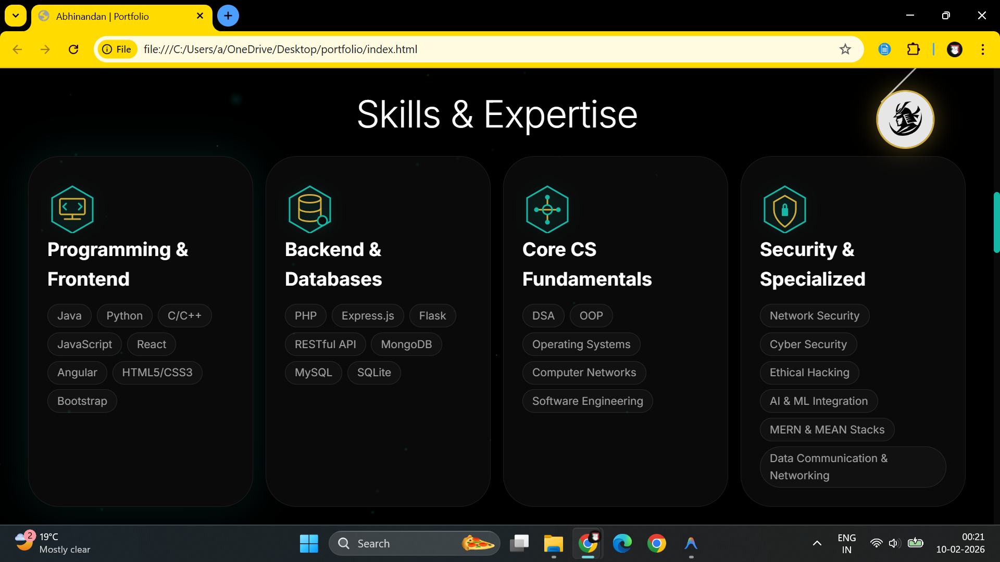
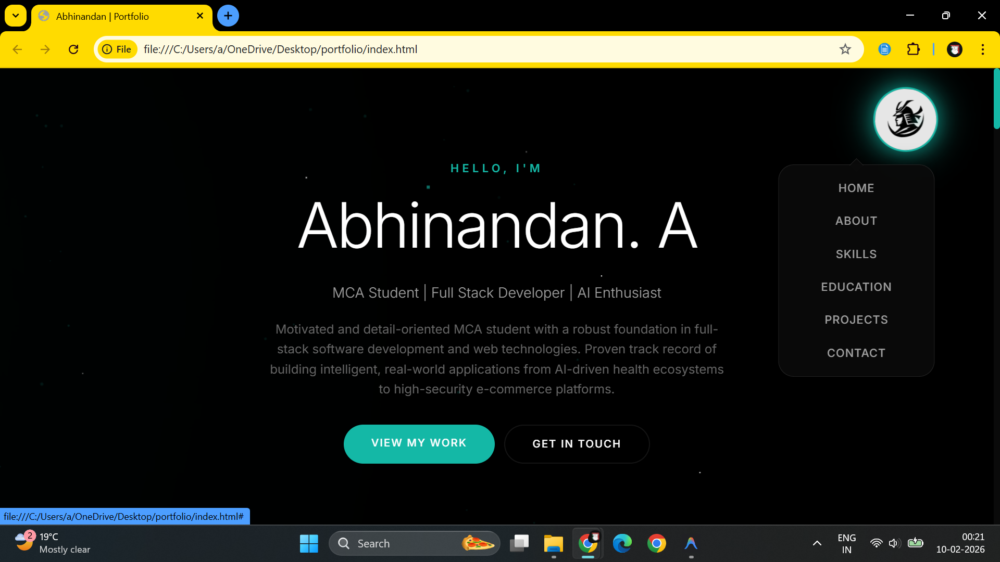

# Professional Portfolio | Abhinandan A.

A modern, minimalistic, and high-performance personal portfolio website built with vanilla technologies. Featuring a dynamic "Starry Night" particle system, responsive layouts, and a curated showcase of full-stack and AI/ML projects.

## 🚀 Live Demo
[View Live Site on Netlify](https://your-site-name.netlify.app) _(Replace with your actual URL)_

## 🛠️ Tech Stack
- **Structure:** Semantic HTML5
- **Styling:** CSS3 (Variables, Grid, Flexbox, Animations)
- **Logic:** Vanilla JavaScript (ES6+)
- **Visuals:** Custom Canvas Particle System
- **Fonts:** Inter & Outfit (Google Fonts)

## ✨ Features
- **Immersive Design:** Fixed particle background with interactive mouse triggers.
- **Glassmorphism:** Modern UI elements with blurred backgrounds and neon highlights.
- **Smooth Navigation:** Logo-triggered dropdown menu and internal scroll-spying.
- **Showcase:** Interactive project cards with tilt effects and live/source links.
- **Fully Responsive:** Optimized for everything from ultra-wide monitors to small mobile screens.

## 📸 Screenshots
### Home Section & Navigation

### Skills & Expertise

### Contact & Footer

## 📂 Featured Projects
### 🏋️ [Fit-Guide](https://github.com/Matrix-46/Fit-Guide)
AI-powered fitness platform featuring real-time pose correction and KNN-based diet recommendations.
- **Stack:** Flask, SQLite, MediaPipe, Python.

### 🛒 [Cart-Deal](https://github.com/Matrix-46/Cart-Deal)
Secure e-commerce platform with a custom Trie search algorithm and Bcrypt security.
- **Stack:** PHP, MySQL, PDO, JavaScript.

## 📫 Connect with Me
- **GitHub:** [@Matrix-46](https://github.com/Matrix-46)
- **LinkedIn:** [Abhinandan A](https://linkedin.com/in/abhinandan1010)
- **Email:** abhinandan.a1010@gmail.com

---
Built with ❤️ by Abhinandan. A.
